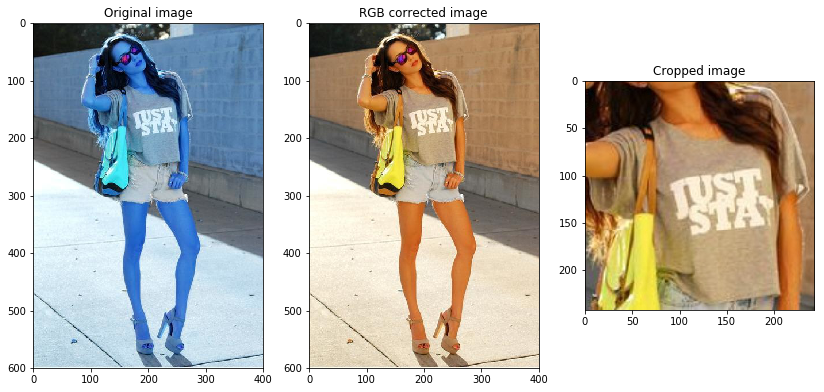
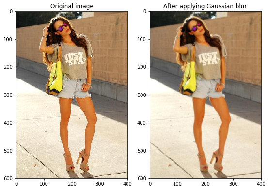
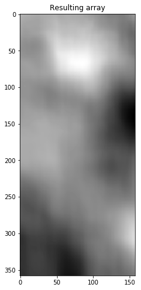
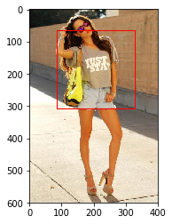

# Template Matching

A template matching problem - where the templates are actual crops of the given images. 

So I chose OpenCV's matchTemplate functionality for this. The `matchTemplate()` function is fast and easy to use, usually yields robust results. There are 6 different matching algorithms we can use with this function.
  - TM_CCOEFF
  - TM_CCOEFF_NORMED
  - TM_CCORR
  - TM_CCORR_NORMED
  - TM_SQDIFF
  - TM_SQDIFF_NORMED

All the `_NORMED` methods give output as a normalized value between 0.0 to 1.0. In TM_CCOEFF and TM_CCORR, maximum value corresponds to high probability of match, while in TM_SQDIFF_NORMED minimum value corresponds to high probability of a match. I chose TM_CCOEFF_NORMED since it gave consistent result with few of the matches I tested and it produces results in the range of 0.0 to 1.0, so that thresholding can be applied.


## Assumptions

I have made the following assumptions before proceeding the task

1. `Crops` folder contains cropped patches from the `Images` folder
2. Cropped images are not rotated. But they are resized while maintaining aspect ratio
3. Duplicate images may be found in both crops and images folders
4. Accuracy preferred over Speed
5. Usage of OpenCV's inbuilt functions as they are more reliable and robust
6. Sobel edge detector was not used before matching, since it didn't make any significant difference in multiple tests

## Approach

Approach I have followed:

1. Get original images in an array
2. Load the original image and cropped image
3. Apply little bit of Gaussian Blur to the images to remove noise
4. For different sizes of given template,
 1. Use cv2.matchTemplate to match the image and template
 2. Get the top-left and bottom-right corners and maximum match value
 3. Compare the max value against the last obtained max value
 4. If max value greater than last-max-value, insert maxvalue and coordinates in queue
 5. Else return the last obtained max value along with coordinates
5. Apply thresholding, return the values if max value is greater than the threshold
6. Append the template name and coordinates to the dictionary
7. Repeat steps 1-5 for the all the images
8. Finally return the dictionary containing the output

## Importing required libraries


```python
import cv2 
import matplotlib.pyplot as plt
import numpy as np
import collections
import time
import glob
import hashlib
```

## Visualizing images and crops

I used OpenCV's `imread()` function to read the image data. By default it reads images in BGR mode. So we have to convert it into RGB for visualization. This does not have any effect on template matching whatsover.


```python
img_o = cv2.imread('images/bac3be95-f050-4fbb-b66e-9e24ded9d991.jpg')
img = cv2.cvtColor(img_o,cv2.COLOR_BGR2RGB)
cr = cv2.imread('crops/3ee562a4-e1a6-4e17-8f30-38d2746a5d32.jpg')
cr = cv2.cvtColor(cr,cv2.COLOR_BGR2RGB)

plt.figure(figsize=(14,8))
plt.subplot(131)
plt.title("Original image")
plt.imshow(img_o)
plt.subplot(132)
plt.title("RGB corrected image")
plt.imshow(img)
plt.subplot(133)
plt.title("Cropped image")
plt.imshow(cr)

plt.show()
```





## Gaussian Blur

I have applied `GaussianBlur()` for both the original images and crops to remove noise from the images and to make the matcher more generalised. I chose 5x5 kernel with sigma 0 for the function, after experimenting with 3x3, 5x5, 7x7 and 9x9 sizes. 


```python
img_g = cv2.GaussianBlur(img,(5,5),0)

plt.figure(figsize=(14,8))
plt.subplot(131)
plt.title("Original image")
plt.imshow(img)
plt.subplot(132)
plt.title("After applying Gaussian blur")
plt.imshow(img_g)

plt.show()
```





## Matching the template

Now I pass the image and template to `matchTemplate()` function. The `matchTemplate()` function takes the template and slides it over the original image pixel by pixel and calculates the match. The function returns a 2D array containing the value of matches at each position of the template over original image.


```python
result = cv2.matchTemplate(img,cr,cv2.TM_CCOEFF_NORMED)

plt.figure(figsize=(14,8))
plt.title("Resulting array")
plt.imshow(result,cmap='gray')
```


    <matplotlib.image.AxesImage at 0x7fcaf3c570f0>





Eventually, the resulting array will be of size `(W-w+1, H-h+1)` where (W,H) is the size of original image and (w,h) is the size of template. Since I have used `TM_CCOEFF_NORMED` method for matching, the values in the resultant array will be in the range 0.0 to 1.0. 

Also we can see that the resultant array is smaller than the original image and reduced to one layer


```python
print("Original Image shape: ",img.shape)
print("Resultant Image shape: ",result.shape)
```

    Original Image shape:  (600, 400, 3)
    Resultant Image shape:  (358, 158)


The maximum value and position can be obtained using the `minMaxLoc` function in OpenCV. The location of maximum value gives the position(x,y) of top-left corner of the template in original image.

Also, I apply desired thresholding to filter out false positives in the next step.


```python
_, max_val, _, max_loc = cv2.minMaxLoc(result)

print("Maxmimum match: ",max_val)
print("Location of match: ", max_loc)
```

    Maxmimum match:  0.4131074547767639
    Location of match:  (86, 67)


Plotted the match over the original image using `rectangle` function of OpenCV. I passed top-left and bottom-right corner to the rectangle function. Bottom-right can be obtained by adding the hegiht and width of the template to the top-left corner


```python
top_left = max_loc
h,w = cr.shape[:2]
bottom_right = (max_loc[0]+w , max_loc[1]+h)

cv2.rectangle(img,top_left,bottom_right,255,2)
plt.imshow(img)
```


    <matplotlib.image.AxesImage at 0x7fcaf3aa32e8>





## Matching for different sizes of templates

Since the templates are of different sizes, the match score becomes very less when using matchTemplate function. To solve this issue, I have reduced the template size by 90% of the original template size in a loop. The loop runs and tries to match until a good score comes or the template size becomes too small for matching

While matching for different sizes, the score generally starts to increase until a maximum value and again starts to reduce. I consider the local maxima for the current template size and make it as best match.

## Choice of Data Structure

I used deque (FIFO) to keep track of the maximum match value. Once the maximum match is found, the matching will break for the current image. 

Also to eliminate repeated matching for duplicate templates, I used hashed dictionary, where key is the `md5` hash of file (not file name) and value is an array containing the filenames of files having same hash. By this way matching templates has been reduced from `274 files to 164 files`

## Not found crops

Finally, I iterated through the values in the `found_crops` array and selected the templates which are not found in the `match_dict`. These files are not found in any of the images and put under the key `'na'` in the match_dict dictionary

## Functions used in the main code

| Function | Description 
| :--- | :---: 
| md5 | Returns md5 checksum of the file  
| getUniqueCrops | Returns hash dict of unique crops filenames 
| matchCrop | Does the template matching, returns -1 if no match found 
| getCropsAssociation | Helper function to pass images and crops to matcher function 


```python

```
